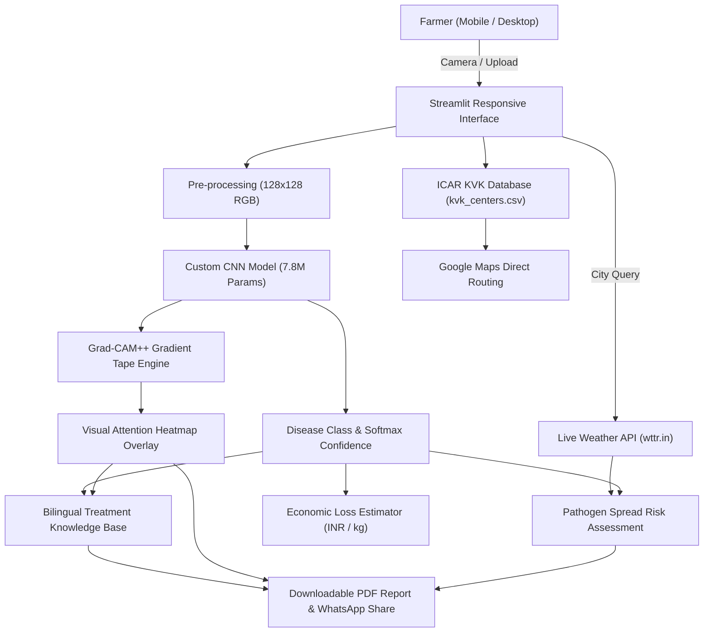

# 🌿 AgriGuard: AI-Powered Crop Disease Intelligence & Mobile Pathology

<div align="center">

[](https://python.org)
[](https://streamlit.io)
[](https://tensorflow.org)
[](https://github.com/SanchayCoder06/CROP-DISEASE-DETECTION-USING-MACHINE-LEARNING-)
[](https://github.com/SanchayCoder06/CROP-DISEASE-DETECTION-USING-MACHINE-LEARNING-)

**An explainable, mobile-optimized agricultural pathology system empowering farmers with instant disease diagnostics, weather spread forecasting, economic loss assessment, and direct Krishi Vigyan Kendra (KVK) navigation.**

*Developed as an EPICS (Engineering Projects in Community Service) initiative at VIT Bhopal University under the guidance of Dr. Anupam Sen.*

---

</div>

## 📌 Problem & Impact

India is home to **140+ million farming households**, yet over 80% lack real-time access to qualified agronomists. Misidentified crop diseases lead to catastrophic yield losses, pesticide overuse, and severe financial distress. 

**AgriGuard** delivers an all-in-one AI companion accessible directly on farmers' smartphones with zero complex setup.

---

## ✨ Key Features & Mobile Capabilities

### 📱 1. Mobile & Phone Optimized Experience
- **Live Smartphone Camera Capture**: Point the phone camera at any affected leaf in the field to snap and analyze instantaneously.
- **Touch-Friendly Glassmorphism UI**: High-contrast, large-tap touch targets (min 48px hit areas), swipeable scrollable tab navigation, and responsive typography across Android and iOS viewports.
- **Bilingual Interface**: Full support for **English** and **Hindi (हिंदी)** with localized agricultural terminologies.

### 🧠 2. Deep Learning Diagnosis (94.61% Accuracy)
- Custom 10-layer Convolutional Neural Network (CNN) trained on ~87,000 leaf images across **38 distinct disease and healthy classes**.
- Highly optimized inference pipeline using `trained_model.keras`.

### 🔬 3. Transparent Explainability (Grad-CAM++)
- Visual heatmaps showing *exactly which leaf pixels* triggered the diagnosis.
- Eliminates "black box" AI distrust by highlighting lesion clusters and fungal growth zones.

### 💊 4. Dual Action Plans (Organic + Chemical)
- Curated agronomic remedies (dosages in g/L or ml/L) tailored to Indian farming contexts.
- Prevention strategies for upcoming crop cycles.

### ⛅ 5. Live Weather-Driven Spread Risk
- Real-time weather integration (temperature, humidity, precipitation).
- Pathogen-specific spread modeling (fungal, bacterial, viral, pest) to warn farmers before outbreaks multiply.

### 💰 6. Economic Loss Calculator
- Estimates potential crop losses in **kilograms** and **INR (₹)** based on cultivated acreage and APMC market prices.

### 📍 7. ICAR Krishi Vigyan Kendra (KVK) Locator
- Comprehensive directory of KVK centers across all Indian States and Union Territories.
- **One-tap Google Maps Navigation** to guide farmers directly to their nearest agricultural research station.

### 📲 8. Field Reports & WhatsApp Sharing
- Instant auto-generated PDF diagnostic report with leaf snapshots and Grad-CAM overlays.
- Direct WhatsApp sharing link to consult with local agricultural officers and fellow farmers.

---

## 🏗️ System Architecture



---

## 🌿 Supported Crops & Diseases (38 Classes)

| Crop | Diseases Covered |
| :--- | :--- |
| **Apple** | Scab, Black Rot, Cedar Apple Rust, Healthy |
| **Blueberry** | Healthy |
| **Cherry** | Powdery Mildew, Healthy |
| **Corn (Maize)** | Cercospora / Gray Leaf Spot, Common Rust, Northern Leaf Blight, Healthy |
| **Grape** | Black Rot, Esca (Black Measles), Leaf Blight, Healthy |
| **Orange** | Huanglongbing (Citrus Greening) |
| **Peach** | Bacterial Spot, Healthy |
| **Pepper (Bell)** | Bacterial Spot, Healthy |
| **Potato** | Early Blight, Late Blight, Healthy |
| **Raspberry** | Healthy |
| **Soybean** | Healthy |
| **Squash** | Powdery Mildew |
| **Strawberry** | Leaf Scorch, Healthy |
| **Tomato** | Bacterial Spot, Early Blight, Late Blight, Leaf Mold, Septoria Leaf Spot, Spider Mites, Target Spot, Yellow Leaf Curl Virus, Mosaic Virus, Healthy |

---

## 🚀 Quickstart & Installation

### 1. Clone Repository
```bash
git clone https://github.com/SanchayCoder06/CROP-DISEASE-DETECTION-USING-MACHINE-LEARNING-.git
cd CROP-DISEASE-DETECTION-USING-MACHINE-LEARNING-
```

### 2. Set Up Environment
```bash
python -m venv .venv
# On Windows:
.venv\Scripts\activate
# On Linux / macOS:
source .venv/bin/activate
```

### 3. Install Dependencies
```bash
pip install -r requirements.txt
```

### 4. Run AgriGuard
```bash
streamlit run app.py
```
Open your browser at `http://localhost:8501` (or access via local network IP on your mobile phone connected to the same Wi-Fi).

---

## 📂 Repository Structure

```
├── app.py                      # Core Streamlit Web Application (Mobile-Optimized)
├── trained_model.keras         # Production Deep Learning CNN Model (31.4 MB)
├── kvk_centers.csv             # Database of All-India Krishi Vigyan Kendras
├── requirements.txt            # Application Dependencies
├── home_page.jpeg              # Brand & Hero Media
├── test_images/                # Sample test leaf images for quick evaluation
│   ├── apple_cedar_rust.jpg
│   ├── cherry.JPG
│   ├── peach.jpg
│   └── apple_healthy.jpg
├── Train_plant_disease.ipynb   # Model Training Notebook
├── Test_Plant_Disease.ipynb    # Evaluation & Grad-CAM Analysis Notebook
├── train.py                    # Standalone CNN Training Pipeline
├── test_model.py               # Batch Test & Evaluation Script
├── train_and_test.py           # Training and Testing Orchestrator
├── training_hist.json          # Loss & Accuracy Metrics History
├── .gitignore                  # Git Ignore Configuration
└── README.md                   # Project Documentation
```

---

## 👥 EPICS Project Credits

- **Faculty Supervisor**: Dr. Anupam Sen
- **Program**: EPICS (Engineering Projects in Community Service)
- **Institution**: School of Computing Science & Engineering, VIT Bhopal University

---

<div align="center">

*Empowering agriculture through artificial intelligence and community engineering.* 🌾🚜

</div>
